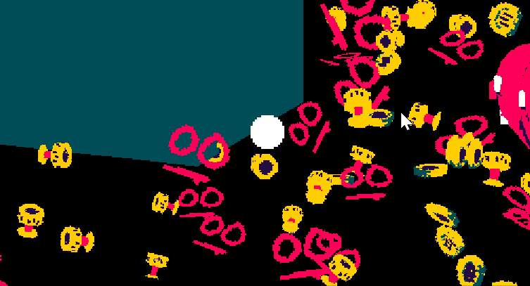

# Stack3D
The fastest method of Sprite Stacking in Gamemaker!

(As a benchmark, using this technique I can have 1500 sprite stacked models drawing at once at 60 fps. Using normal sprite stacking I can have about 200 at 60 fps.)

# INTRO
Hello! This is a message from me, dev_dwarf, who created this example project.

In the readme I want to give some explanation and advice. It also shows that the project is available under the MIT
License (Which allows you to freely use it in your own work, with or without attribution). That said, I'd love a 
shout out, or even for you to just send me what you've done with it!

If you need help, or want to suggest changes, please reach out on twitter (@dev_dwarf) or discord (https://discord.gg/5URwf82)

# HOW THIS WORKS
This is a system to replace the naive sprite stacking technique with actual 3D.

It works by loading in a voxel model as a vertex buffer, and then drawing it. Hopefully you won't have to 
understand much of this to work with the system.

Each 3d model you want to draw will need to be loaded using **load_stacked_sprite**. This will return a vertex buffer,
which you should probably freeze using vertex_freeze to increase performance. Then in the draw event you will use vertex_submit
to draw the model. You will find attached examples of all of this in o3Dtest.

Pros:
	Incredible performance over normal sprite stacking.
	Rotation in all axis.
	Simplified workflow, due to being able to directly import models from MagicaVoxel (use o slice).
	
Cons:
	Discards camera system. Due to the 3d functions being used, default camera functions no longer work.
	No depth occlusion.
	
# SETUP
In order to use the system in your own projects, copy over the sprite_stack_vertex_toolkit script, and the oCamera object. You will also need
a system to handle loading the vertex buffers into memory. An example system is in o3Dtest and pDepth.

There are also a few shaders as examples of how you could achieve certain effects.

# IMPORTANT: YOU WILL ALSO NEED TO CHANGE THE SETTINGS OF THE TEXTURE GROUPS!

go to tools > texture groups and disable automatic crop. If you have large models, you may also need
to increase the size of your texture pages.

## Feel free to send a pull request if there are things you would like to be changed, or features you would like to add!

# MIT
Copyright 2021 Logan C Forman (dev_dwarf)

Permission is hereby granted, free of charge, to any person obtaining a copy of this software and associated documentation files (the "Software"), to deal in the Software without restriction, including without limitation the rights to use, copy, modify, merge, publish, distribute, sublicense, and/or sell copies of the Software, and to permit persons to whom the Software is furnished to do so, subject to the following conditions:

The above copyright notice and this permission notice shall be included in all copies or substantial portions of the Software.

THE SOFTWARE IS PROVIDED "AS IS", WITHOUT WARRANTY OF ANY KIND, EXPRESS OR IMPLIED, INCLUDING BUT NOT LIMITED TO THE WARRANTIES OF MERCHANTABILITY, FITNESS FOR A PARTICULAR PURPOSE AND NONINFRINGEMENT. IN NO EVENT SHALL THE AUTHORS OR COPYRIGHT HOLDERS BE LIABLE FOR ANY CLAIM, DAMAGES OR OTHER LIABILITY, WHETHER IN AN ACTION OF CONTRACT, TORT OR OTHERWISE, ARISING FROM, OUT OF OR IN CONNECTION WITH THE SOFTWARE OR THE USE OR OTHER DEALINGS IN THE SOFTWARE.
